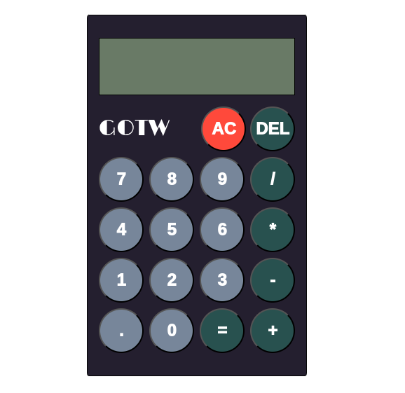

# Calculator Application

## Project Description
This project is a browser-based calculator that performs basic arithmetic operations such as addition, subtraction, multiplication, and division. It is designed to be intuitive, responsive, and feature-rich, meeting all the functionality expected from a basic calculator. Additional features include error handling, keyboard support, and support for floating-point numbers.

## User Interface

## Features
- **Basic Arithmetic**: Supports addition, subtraction, multiplication, and division.
- **Chained Operations**: Handles sequential calculations without resetting the display.
- **Error Handling**: Displays appropriate error messages for invalid operations like division by zero.
- **Clear Functionality**: Resets the calculator to its default state.
- **Backspace Support**: Allows users to undo their last input.
- **Floating-Point Numbers**: Users can input decimal values.
- **Keyboard Support**: Users can interact with the calculator using their keyboard.

## How to Run the Project
1. Save the following files in a directory:
   - **HTML File**: Create an `index.html` file containing the calculator structure.
   - **CSS File**: Create a `styles.css` file for styling the calculator.
   - **JavaScript File**: Create a `scripts.js` file for handling the logic.
2. Open `index.html` in any modern web browser to start using the calculator.

## Technologies Used
- **HTML**: For structuring the calculator interface.
- **CSS**: For styling the user interface.
- **JavaScript**: For implementing functionality and interactivity.

